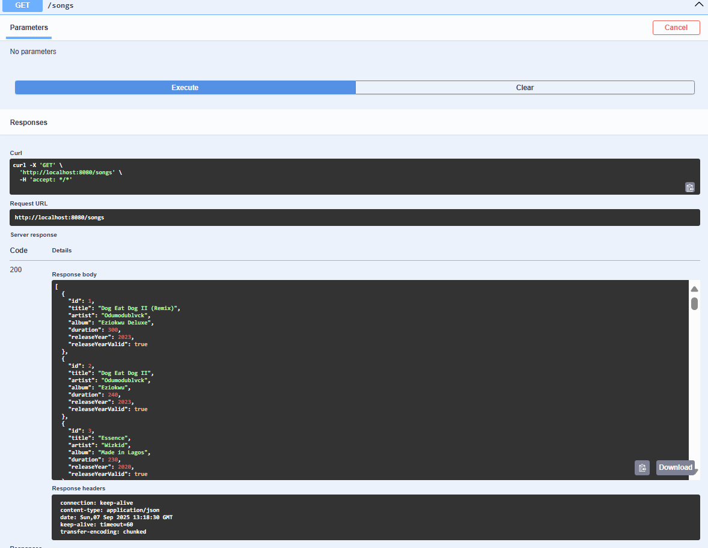
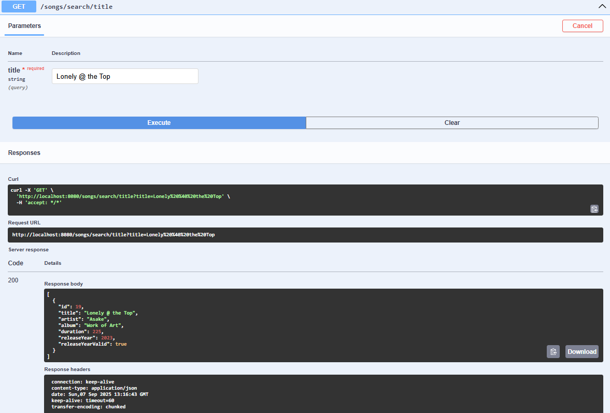
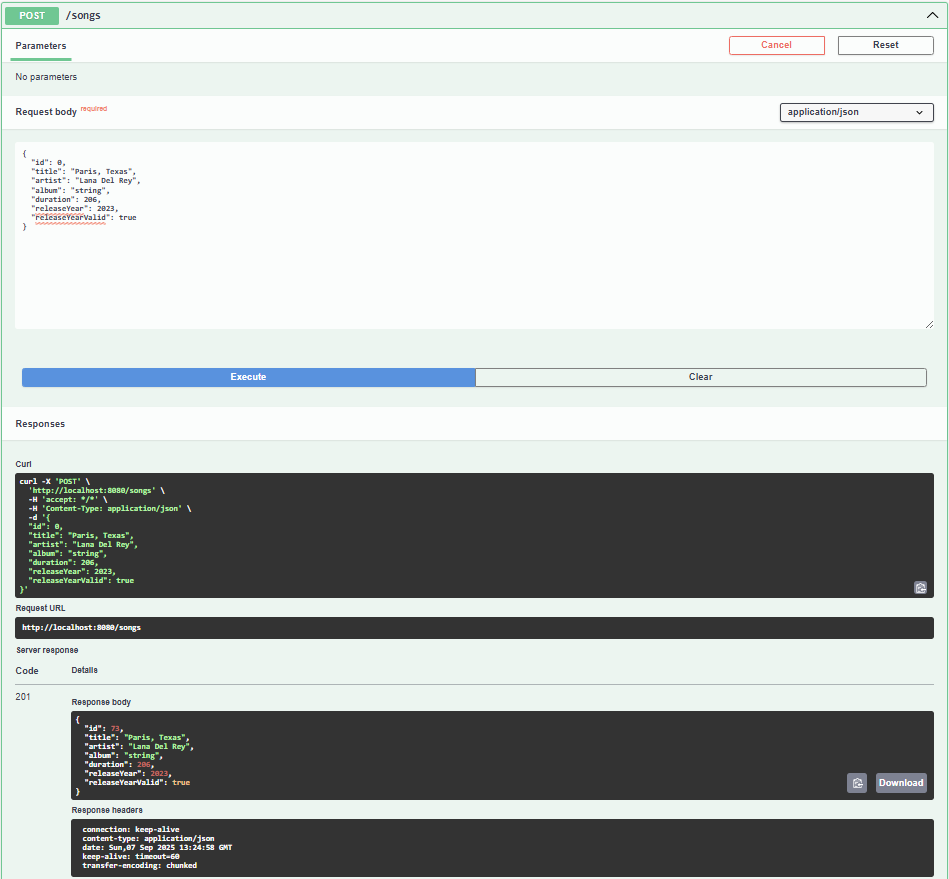

# Music Player API

This REST API lets you **manage a library of pseudo songs** for demonstration and testing purposes.

This API lets you:
 - Add new songs
 - View all songs or paginate results
 - Update existing songs
 - Delete songs
 - Search songs by title, artist, album, or combined filters

It comes with:

- A preloaded dataset of 42 songs

- An interactive API testing via Swagger UI 

---

#  Project Structure

The **database dump file** is located at: 
 ```musicplayer/src/main/resources/```


```
musicplayer/
├── src/main/java/com/musicplayer/
│ ├── controller/ #(SongController.java)
│ ├── exception/ #Custom exception & global handler
│ ├── model/ # (Song.java)
│ ├── repository/ #(SongRepository.java)
│ ├── service/ #(SongService.java)
│ └── MusicPlayerApplication.java
│
├──src/main/resources/
│ ├── application.properties #DB config
│ └── musicplayerdb.sql #(Preloaded dataset of 42 songs)
│
├── src/test/java/com/musicplayer/
│ ├── controller/ #(SongControllerTest.java)
│ ├── model/ #(SongTest.java)
│ ├── repository/ #(SongRepositoryTest.java)
│ └── service/  #(SongService.java)
│
├── pom.xml
└── README.md

```
# Interactive API Documentation (Swagger UI)

Interactive Swagger UI is available when the app is running locally:

🔗 [Swagger UI](http://localhost:8080/swagger-ui.html)

If deployed, replace `localhost:8080` with your server URL 

---  
# Getting Started  

1) Create a mySQL database 

``` 
CREATE DATABASE musicplayerdb;
``` 

2) Configure the application.properties (musicplayer/src/main/resources/) with your MYSQL credentials 

3) Import the database dump (musicplayer/src/main/resources/)


```
mysql -u root -p musicplayerdb < src/main/resources/musicplayerdb.sql

```

4) Build and Run the App

```
# Clone the repository
git clone https://github.com/your-username/musicplayer.git

# Go into the project folder
cd musicplayer

# Build & run the app
mvn clean install
mvn spring-boot:run

```

Alternatively, you can simply run ```MusicPlayerApplication.java``` directly from your IDE


Once the app starts go to http://localhost:8080/swagger-ui.html

---
# API Endpoints


| Method     | Endpoint               | Description              | Query Params                          |
| ---------- | ---------------------- | ------------------------ | ------------------------------------- |
| **GET**    | `/songs`               | Get all songs            |                                       |
| **GET**    | `/songs/paginated`     | Get paginated songs      | `page`, `size`, `sortBy`, `direction` |
| **GET**    | `/songs/{id}`          | Get a song by ID         |                                       |
| **POST**   | `/songs`               | Add a new song           |                                       |
| **PUT**    | `/songs/{id}`          | Update a song            |                                       |
| **DELETE** | `/songs/{id}`          | Delete a song            |                                       |
| **GET**    | `/songs/search/title`  | Search by title          | `title`                               |
| **GET**    | `/songs/search/artist` | Search by artist         | `artist`                              |
| **GET**    | `/songs/search/album`  | Search by album          | `album`                               |
| **GET**    | `/songs/search`        | Search combined criteria | `title`, `artist`, `album`            |

___


# Example Requests

## 1. Get All Songs 

<p align="center">
  
</p>


## 2. Search Songs by Title

<p align="center">
  
</p>


## 3. Create a Song
<p align="center">
  
</p>

___

# Next Steps

Add playlist management (create, update)

Expand the dataset to include real songs


